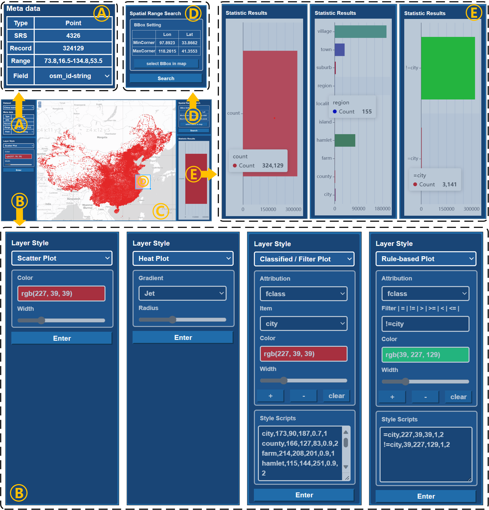
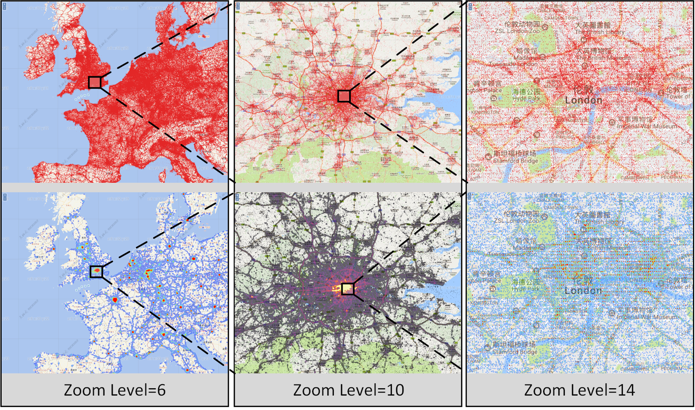
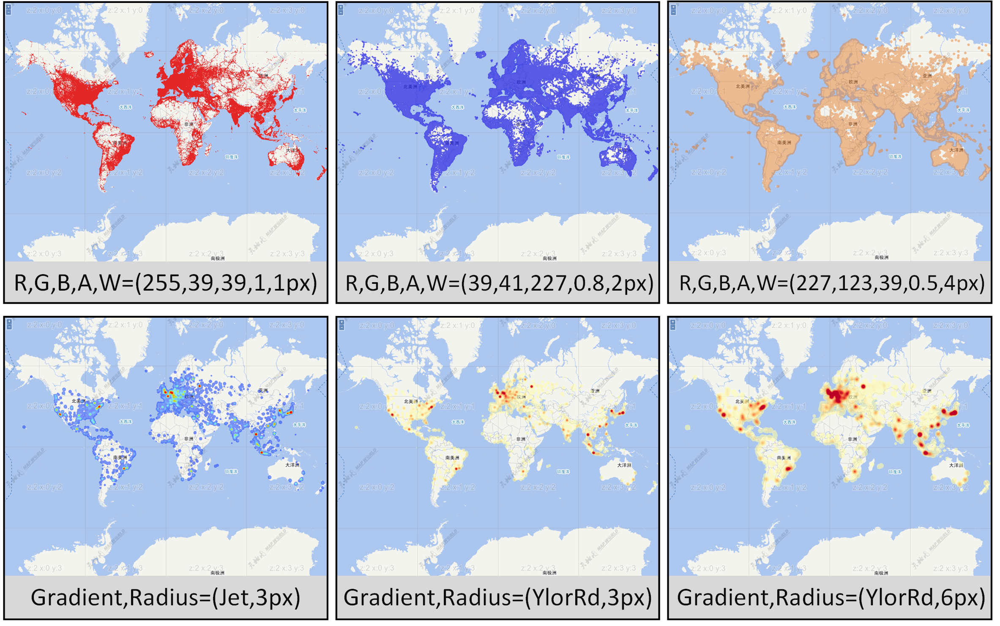

# HiVQ: A Fast Interactive Visual Query Approach of Geospatial Big Data Based on Visualization-oriented Optimizations

## 1. Introduction
HiVQ is an efficient approach for interactive visual queries of  billion-scale geospatial big data. HiVQ innovativly proposes a visualization-oriented optimization model. Compared to traditional visual query methods follow the "Query then Visualize" paradigm which focuses on optimizing the two phases separately to reduce the response latency of visual queries, HiVQ designs a "Query as Visualize" solution to optimize visual query tasks including map visualization and aggregate statistics, the general pipeline of implementing visual query algorithms of HiVQ can be summarized as two steps: data mapping and visual query. 

* **data mapping.** A pyramid-based recursive partitioning strategy is designed for hierarchical rasterization, aggregation, and indexing of geospatial big data, thus generating regular and hierarchically related pixel mapping units, and constructing an Attribute-Aggregated Pixel-Quad-R-tree (AAPQR-tree) index, which is used to efficiently support for the visual query.
  
* **visual query.** The map visualization algorithm based on the level-aware query strategy and the aggregate statistics algorithm based on the accumulation-based query strategy are propoesd to realize real-time pixel value computation of visual queries. HiVQ converts the map visualization and aggregate statistics into the computation for the specific pixel values, i.e. calculating the rasterization and aggregation values of the pixels to generate the final map visualizations and statistical charts.

## 2. User Interaction
HiVQ builds a demonstration system based on browser/server architecture. Efficient visual query algorithms encapsulated on the server side. Users can access the system and make interactive visual queries of geospatial big data on the web map, including zooming and panning of the dataset at each zoom level and selected spatial region, selecting attribute fields for real-time style customization, and obtaining accurate aggregation results of spatial and attribute dimensions. Fig.1 gives the use interface of HiVQ.


*Fig.1. The Use Interface of HiVQ*

In HiVQ, analyzers can perform real-time interactive visual query of geospatial big data, they can set visualization styles
for any spatial region, to realize a rich type of multilevel map visualization (scatter plot, heat plot, classified plot, filtered
plot, rule-based plot) and accurate aggregate statistics (total count, classified count, rule-based count). Specifically, the interactive visual query effects are mainly include the following kinds:
   
1. **scatter plot and aggregation.**

Fig.2 shows the effects of the scatter plot and aggregation for the geospatial data. HiVQ can quickly present the map visualization result of geospatial data as well as total count number of geospatial objects to the user in order to provide an intuitive view of the data in general.


*Fig.2. Scatter Plot and Aggregation of HiVQ*

2. **classified plot and aggregation.**

Fig.3 shows the effects of the classified plot and aggregation for the geospatial data. HiVQ can render the visualization result and count the geospatial object number of each field of an attribute, thus quickly presenting to the user the classified plot effects and the count number of each field.


*Fig.3. Classified Plot and Aggregation of HiVQ*

3. **filtered plot and aggregation.**

Fig.4 shows the effects of the filtered plot and aggregation for the geospatial data. HiVQ can render the visualization result and count the geospatial object number of the filtered field of an attribute, thus quickly presenting to the user the filtered plot effects and the count number of the filtered field.


*Fig.4. Filtered Plot and Aggregation of HiVQ*

4. **rule-based plot and aggregation.**
   
Fig.5 shows the effects of the rule-based plot and aggregation for the geospatial data. HiVQ can render the visualization result and count the number of gespatial objects that satisfied the setting rules of an attribute, thus quickly presenting to the user the rule-based plot effects and the count number of the setting rules.


*Fig.5. Rule-based Plot and Aggregation of HiVQ*

5. **heat plot.**

Fig.6 shows the effects of the heat plot for the geospatial data. HiVQ can quickly generate heat plot effects based on the distribution density of the geospatial data, and can update the heat extremes to generate new heat map effects in real time based on changes in the viewing region.


*Fig.6. Heat Plot of HiVQ*

6. **map zooming and panning.** 

Fig.7 shows the effects of the map zooming and panning for the geospatial data. Users can browse the data from rough to detail and have a more intuitive understanding of the spatial distribution of features in the dataset, which provides basic support for further exploration and analysis of geospatial big data.


*Fig.7. Map Zooming and Panning in HiVQ*

7. **style customization.**

Fig.8 shows the interactive style customization of geospatial data in HiVQ. Users can interactively style all the map visualization types. For scatter plot, classified plot, filtered plot and rule-based plot, users can change parameters such as color, transparency, line width. For heat plot, users can change parameters such as heat radius and heat gradients. For all these style customizations, users can get the re-rendered results in real time.


*Fig.8. Style Customization in HiVQ*

8.  **spatial region selection.**

Fig.9 shows the map visualization and aggregation results of the selected spatial regions in HiVQ. Users can interactively select any spatial region on the web map, and for all map visualization and aggregation types, users can get real-time map visualisation results and aggregate statistics within the query region. 


*Fig.9. Spatial Region Selection in HiVQ*

9.  **attribution field selection.**

Fig.10 shows the map visualization and aggregation results of the selected attribution field in HiVQ. Users can interactively select any field on the attribution pannel in HiVQ, for the classified, filtered, and rule-based aggregation, users can get real-time aggregate statistics of the selected fields.


*Fig.10. Attribution Field Selection in HiVQ*

## 3. Demonstration Case
we conduct case studies on two real datasets to demonstrate the interactive visual query effects of HiVQ.

**OpenCellId** OpenCellId is the world's largest open database of mobile phone stations, containing more than 40 million station locations, whose spatial distribution and density can indirectly reflect the population density or affluence of countries and regions. HiVQ uses scatter plot and heat plot in Fig.11 for intuitive data exploration. Fig.11(a) shows the scatter plot and heat plot with the personalized customization. Fig.11(b) shows the zooming and panning effects on the map. Fig.11(c) shows the visual query results for different filtered regions.

Through the results, we can intuitively browse the spatial distribution of all stations in the global regions, without browsing the incomplete data distribution after sampling, and we can also perceive the density of the data in different local regions. Meanwhile, we drilled down to the region of interest to explore the data in different regions. From the quantitative histogram of the number of stations, it is found that the coverage of stations in China is far less than that in most of the regions in Europe and North America, which can be assessed that the overall data quality of OpenCellId is higher in the regions of North America and Europe as compared to China, thus helping the analysts to select stations from the regions with higher data quality in the dataset for the subsequent analysis.


*Fig.11. Visual query results of global station locations in OpenCellId*

**China Roads** China Roads contains 12503452 road features, and its attribute "road type" contains ten field items including "railway", "highway", "national roads", "provincial roads", "county roads", "county roads", "primary urban roads", "secondary urban roads", "tertiary urban roads" and "quaternary urban roads". HiVQ presents an overall classified plot including map visualizations and classified mileage statistics for all field items (Fig.12(a)). Meanwhile, HiVQ shows the visual query results of selecting and styling specific field items for the road type (Fig.12(b)). Finally, HiVQ displays the visual query results of all urban roads in the three regions of eastern, central, and western China in Fig.12(c).

We can observe that: 1) the secondary urban road occupies a dominant position in China Roads, and the data distribution shows a trend from sparse to dense from west to east, with railways, national roads, and provincial roads dominating in the western region, and urban roads dominating in the eastern region. 2) For the urban roads, the distribution is generally dominated by secondary urban roads but varies in different regions. In eastern China, there is a full range of road categories, with primary and secondary urban roads dominating, and the road network between cities is also very dense, with more convenient transport conditions. In central and western China, primary and secondary urban roads are mainly concentrated in urban areas, while some cities are still dominated by tertiary and quaternary urban roads. In the western region, there are very few quaternary urban roads, and the road network between cities is relatively sparse. Through the above interactive query, analysts can quickly filter out the spatial distribution of relevant road features and mileage statistics to better evaluate the construction of different type of roads in different regions.


*Fig.12. Visual query results of road network in China Roads*


## 4. Program Settings
### 4.1. Experimental environment

*Tab1. Program environment*
| Item             | Type                                              |
|------------------|---------------------------------------------------|
| CPU              | 32 core, Inter(R) Xeon(R) CPU E5-4620 @ 2.6Ghz |
| Memory           | 256 GB                                            | 
| Operating System | Ubuntu 20.04  


### 4.2. Experimental Data

*Tab2. Datasets used in the performance experiment*
| Name                        | Type       | Records     |  Schema | 
|-----------------------------|------------|-------------|---------|
| Brightkite                  | Point      | 4,747,281   | lon,lat |
| Wuhan Taxi                  | Point      | 5,758,149   | lon,lat,speed,statue |
| China Mainland POI          | Point      | 8,208,623   | lon,lat,fclass |
| Geonames                    | Point      | 12,365,365  | lon,lat,class |
| Opencellid                  | Point      | 40,719,479  | lon,lat,radio,range |
| China Roads                 | LineString | 132,214,835 | lon,lat,fclass |
| OSM Global Roads            | LineString | 717,048,198 | lon,lat,highway |
| China Mainland farmlands    | Polygon    | 144,392,591 | lon,lat,croptype |
| OSM Global Buildings        | Polygon    | 804,028,282 | lon,lat |

*Tab3. Datasets used in the online demo*
| Name                        | Type       | Records     |     Schema     | 
|-----------------------------|------------|-------------|----------------|
| China Mainland Point        | Point      | 324,129     | lon,lat,fclass |
| China Mainland Railway      | LineString | 1,545,220   | lon,lat,fclass |
| China Mainland Traffic      | Polygon    | 414,310     | lon,lat,fclass |


## 5. Program Dependencies
### 5.1. C++
* [MPICH](https://www.mpich.org/) ( recommended version 3.3.2 )
> ~~~
> wget http://www.mpich.org/static/downloads/3.3.2/mpich-3.3.2.tar.gz
> tar -zxvf mpich-3.3.2.tar.gz
> cd mpich-3.3.2
> ./configure --disable-fortran 
> make && make install
> ~~~

* [zlib](http://www.zlib.net/) ( recommended version 1.2.11 )
> ~~~
> wget http://www.zlib.net/zlib-1.2.11.tar.gz
> tar -zxvf zlib-1.2.11.tar.gz
> cd zlib-1.2.11
> ./configure
> make && make install
> ~~~
  
* [libpng](http://www.libpng.org/pub/png//libpng.html) ( recommended version 1.2.59 )
> ~~~
> wget https://sourceforge.net/projects/libpng/files/libpng12/1.2.59/libpng-1.2.59.tar.gz
> tar -zxvf libpng-1.2.59.tar.gz
> cd libpng-1.2.59
> ./configure
> make && make install
> ~~~

* [mapnik](https://mapnik.org) ( recommended version 3.0.23 )
> ~~~
> sudo apt-get install libmapnik-dev
> ~~~

* [Boost](https://www.boost.org) ( recommended version 1.7.2 )
> ~~~
> wget https://sourceforge.net/projects/boost/files/boost/1.72.0/boost_1_72_0.tar.gz
> tar -zxvf boost_1_72_0.tar.gz
> cd boost_1_72_0
> ./bootstrap.sh --prefix=/usr/local
> ./b2 install --with=all
> ~~~

* [shapelib](http://shapelib.maptools.org/) ( recommended version 1.5.0 )
> ~~~
> wget https://download.osgeo.org/shapelib/shapelib-1.5.0.tar.gz
> tar -zxvf shapelib-1.5.0.tar.gz
> cd shapelib-1.5.0
> ./confirue
> make && make install
> ~~~

* [Crow](https://github.com/ipkn/crow) ( recommended version 0.1 )

    header files and are provided in "./dep_package/crow", moving "crow" to "./server/include".

* [Hicore](https://gitee.com/CoreSpatial/core-open) ( closed-source )

    header files and binary files are provided in "./dep_package/Hicore", moving "hicore" to "./server/include" and moving and "libhicore.a" and "libhicore.so" to "./server/bin" separately.


### 5.2. Python

* [Flask](https://flask.palletsprojects.com/en/2.0.x/) ( recommended version 2.0.3 )
> ~~~
> pip install -U Flask -i http://pypi.douban.com/simple/
> ~~~

### 5.3. JavaScripts

* [openLayers](https://openlayers.org/) ( recommended version 6.13.0 )
> ~~~
> npm install ol
> ~~~

* [Echarts](https://echarts.apache.org/en/index.html) ( recommended version 5.5.1 )
> ~~~
> npm install echarts
> ~~~


## 6. Operating Steps

### 6.1. Compile

the source codes of server side are included in **./server** and the the source codes of browser side are included in **./browser**. Run the following command to generate the executable programs:
> ~~~
> cd server             # Go to source directory
> mkdir build           # Create a build directory
> cd build              # Move into build directory
> cmake ..              # Configure for your system
> make                  # Generate the executable programs
> cd ..                 # Move back to source directory
> ~~~

### 6.2. Visual Query of Geospatial Vector Data
> ```shell
> sh ./runServer.sh
> ```

Edit the following parameters in "runServer.sh"
* **_point_type_**:   file type of geospatial vector point data (default: shapefile)
* **_point_shpPath_**:   shapefile path of geospatial vector point data (default: ./China_mainland_poi/China_mainland_poi.shp)
* **_point_srs_**:   the spatial reference system of the point dataset coordinates, 4326 or 3857 can be select (defalut: 4326)
* **_point_field_**:  the attribution of geospatial vector point data, "fclass" is the attribute name, "s" is the classification type of the attribute (default: null)
* **_linestring_type_**:   file type of geospatial vector linestring data (default: shapefile)
* **_linestring_shpPath_**:    shapefile path of geospatial vector linestring data (default: ./China_mainland_railway/China_mainland_railway.shp)
* **_linestring_srs_**:   the spatial reference system of the linestring dataset coordinates, 4326 or 3857 can be select (defalut: 4326)
* **_linestring_field_**:  the attribution of geospatial vector linestring data, "fclass" is the attribute name, "s" is the classification type of the attribute (default: null)
* **_polygon_type_**:   file type of geospatial vector polygon data (default: shapefile)
* **_polygon_shpPath_**: shapefile path of geospatial vector polygon data (default: ./China_mainland_traffic/China_mainland_traffic.shp)
* **_polygon_srs_**:   the spatial reference system of the polygon dataset coordinates, 4326 or 3857 can be select (defalut: 4326)
* **_polygon_field_**:  the attribution of geospatial vector polygon data, "fclass" is the attribute name, "s" is the classification type of the attribute (default: null)

Input http://localhost:8888/HiVQ in the browser after the following info printed in "./TMS_server.log
"
> ~~~
> <<<<<<<<<<<<<<      read point shapefile: china_mainland_poi.shp successfully        >>>>>>>>>>>>>>
> <<<<<<<<<<<<<<  read linestring shapefile: china_mainland_railway.shp successfully   >>>>>>>>>>>>>>
> <<<<<<<<<<<<<<   read polygon shapefile: china_mainland_traffic.shp successfully    >>>>>>>>>>>>>>
> ~~~

### 6.3. Stop Program automatically
> ~~~
> sh ./stop.sh
> ~~~


## 7. Demo
There are some simple example demos of the interactions of HiVQ in the folder **./demo**.


## 8. Related work
* Ma M, Yang A, Wu Y, et al. Disa: A display-driven spatial analysis framework for large-scale vector data[C]//Proceedings of the 28th International Conference on Advances in Geographic Information Systems. 2020: 147-150.
* Ma M, Wu Y, Ouyang X, et al. HiVision: Rapid visualization of large-scale spatial vector data[J]. Computers & Geosciences, 2021, 147: 104665.
* Liu Z, Chen L, Yang A, et al. HiIndex: An Efficient Spatial Index for Rapid Visualization of Large-Scale Geographic Vector Data[J]. ISPRS International Journal of Geo-Information, 2021, 10(10): 647.
* Chen L, Liu Z, Ma M. Interactive Visualization of Geographic Vector Big Data Based on Viewport Generalization Model[J]. Applied Sciences, 2022, 12(15): 7710.
* Chen L, Liu Z, Ma M. HiVecMap: A parallel tool for real-time geovisualization of massive geographic vector data[J]. SoftwareX, 2022, 19: 101144.
* Liu Z, Chen L, Ma M, et al. An efficient visual exploration approach of geospatial vector big data on the web map[J]. Information Systems, 2024, 121: 102333.

## Contact

* Institution   
Zebang Liu @ National University of Defense Technology     
Luo Chen @ National University of Defense Technology   
Mengyu Ma @ National University of Defense Technology   
Anran Yang @ National University of Defense Technology

* Email    
liuzebang19@nudt.edu.cn    
luochen@nudt.edu.cn   
mamengyu10@nudt.edu.cn    
yanganran@nudt.edu.cn

* Tel  
+8613142350585       
+8613975801542   
+8615507487344   
+8615711316876
